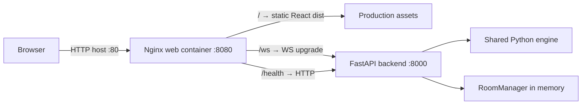

# Deployment

[[Project State]] · [[Точки входа]] · [[Сервер и протокол]] · [[Architecture Decisions]] · [[plans/containerization]]

Production Infrastructure Phase 1 добавляет Docker Compose к существующему local development. Проверено 2026-10-04 на Docker Desktop Linux containers, Windows host. Это production-like запуск без TLS и persistence, не готовый публичный internet deployment.

## Local development

Из корня репозитория, желательно в своём Python 3.12 virtualenv:

```sh
python -m pip install -r requirements-server.txt
python -m app.server_mp
```

В другом терминале:

```sh
cd web
npm ci
npm run dev
```

Открыть http://localhost:5173. Backend по умолчанию слушает 0.0.0.0:8000; main() поддерживает CATAN_HOST/CATAN_PORT. Vite dev использует VITE_WS_URL из web/.env / web/.env.local либо ws://127.0.0.1:8000/ws. Для LAN значение может быть ws://<IP backend>:8000/ws; пример — [web/.env.example](../../web/.env.example).

Desktop по-прежнему использует свои requirements и RUN_*.bat. requirements-server.txt не устанавливает PySide или тесты. Существующий [tools/run_lan.ps1](../../tools/run_lan.ps1) остаётся способом локального запуска.

## Docker production-like

Из корня, при работающем Docker Engine / Docker Desktop в Linux containers mode:

```sh
docker compose up --build
```

Открыть **http://localhost**. Для второго устройства в той же сети — http://<LAN-IP host>, если доступ разрешён сетевыми настройками host. WebSocket URL вводить вручную не требуется.

Запуск в фоне с проверкой готовности:

```sh
docker compose up --build -d --wait
docker compose ps
docker compose logs -f
```

Завершение:

```sh
docker compose down
```

Если порт 80 занят, задать CATAN_WEB_PORT, например в PowerShell:

```powershell
$env:CATAN_WEB_PORT = "8080"
docker compose up --build
```

Тогда адрес — http://localhost:8080, WebSocket — ws://localhost:8080/ws. Это настройка host port Compose, не переменная browser bundle.

## Ports and architecture



| Service / route | Поведение |
| --- | --- |
| web | Единственный опубликованный host port: 80, override CATAN_WEB_PORT |
| backend | Порт 8000 доступен внутри Compose network; ports mapping отсутствует |
| / | React production build, SPA fallback на index.html |
| /assets/ | Реальные static files; отсутствующий asset возвращает 404 |
| /ws | Только exact route; HTTP/1.1, Upgrade/Connection headers, 3600s proxy read/send timeout |
| /health | Проксирует GET backend /health → 200 {"status":"ok"} |

Frontend не использует другие backend HTTP API. Автоматические FastAPI /docs /redoc /openapi.json наружу через Nginx не проксируются. Nginx использует Docker DNS для backend, внешний hostname не задан.

backend healthcheck обращается к 127.0.0.1:8000/health через Python stdlib. web зависит от service_healthy, а не только от факта создания контейнера. Health проверяет ответ процесса, не создаёт комнат и не выполняет сетевых/игровых проверок.

## WebSocket configuration

[wsClient.ts](../../web/src/wsClient.ts) экспортирует defaultWebSocketUrl(), который используют App и fallback WSClient.connect:

- Production build: protocol страницы http/https → ws/wss, host и port берутся из window.location, путь /ws.
- Development: VITE_WS_URL либо локальный backend 127.0.0.1:8000.
- Production намеренно не использует локальный VITE_WS_URL. В собранном Docker bundle подтверждено отсутствие hardcoded localhost/LAN backend addresses.
- .env/.env.local не попадают в Docker build context. UI field URL остаётся существующим ручным override; layout не менялся.

TLS в Compose не добавлен; HTTPS deployment и trust forwarded headers за внешним proxy — отдельная задача.

## Images and dependencies

| Файл | Назначение |
| --- | --- |
| [compose.yaml](../../compose.yaml) | Два сервиса, сеть, web host port, readiness и stop grace period |
| [backend.Dockerfile](../../deploy/backend.Dockerfile) | Official Python 3.12 slim-bookworm, non-root uid 10001, один Uvicorn worker |
| [web.Dockerfile](../../deploy/web.Dockerfile) | Official Node 24 Alpine → npm ci/build → official Nginx Alpine, non-root nginx uid 101 |
| [nginx.conf](../../deploy/nginx.conf) | Static/SPA, /ws и /health proxy; pid в /tmp |
| [.dockerignore](../../.dockerignore) | Allowlist необходимых исходников/config/maps; excludes env, credentials, docs/tests, caches, node_modules и desktop/legacy |
| [requirements-server.txt](../../requirements-server.txt) | 14 точно закреплённых прямых/транзитивных server runtime dependencies |
| [package-lock.json](../../web/package-lock.json) | npm ci input; дополнены пропущенные зависимости, уже объявленные package.json |

Все три base images закреплены OCI digest; обновляются осознанно вместе с проверкой сборки. Backend копирует только package init, server/protocol/resource_path, engine/*.py и 12 JSON-карт. PySide, pytest, desktop SVG и Node не нужны backend runtime. В web runtime нет Node/node_modules/исходников, только Nginx и dist.

Размеры финальных images по docker image ls на проверенной машине: **backend 215 MB, web 93 MB**. Основной размер задают official base images и Python packages; Node build stage не входит в финальный web image. Это показание Docker Desktop disk usage, не оценка размера скачивания по сети.

Исходный package-lock не соответствовал package.json: npm ci в чистом image находил отсутствующие ESLint/TypeScript ESLint dependencies. Lockfile синхронизирован; добавлены 251 package entries, версии всех ранее зафиксированных пакетов сохранены. package.json и framework/tooling не менялись.

## Worker count and shutdown

Запуск backend: python -m uvicorn app.server_mp:app --host 0.0.0.0 --port 8000 --workers 1 --timeout-graceful-shutdown 10. Exec-form CMD доставляет сигнал самому процессу. reload/debug отсутствуют; не используется gunicorn.

**Только один worker и одна backend replica.** Каждый процесс иначе получил бы собственные RoomManager, комнаты и GameState, и клиенты одной комнаты могли бы оказаться в разных состояниях. Docker не меняет эту архитектуру.

Nginx также запускается exec-form как non-root, STOPSIGNAL SIGQUIT. worker_shutdown_timeout=10s ограничивает ожидание живых WebSocket; Compose stop_grace_period=20s у обоих сервисов. При остановке активное WS может закрыться без WebSocket close frame, что клиент обрабатывает существующим reconnect flow.

## Verification — 2026-10-04

- docker compose build и up -d --wait завершились успешно; backend healthy перед стартом web.
- Реальный headless Chrome, два независимых browser contexts: HTML/CSS/JS загружены через Nginx, WS у обоих ws://localhost/ws, Host → Join → Start Match, 19 тайлов у обоих клиентов.
- Через React UI выполнены все 8 setup placements и Roll: 9 ACK applied=true, tick=9 у обоих, одинаковые публичные постройки/roll; чужие res и seed отсутствуют. Browser page errors отсутствуют. Изображение поля просмотрено.
- /health возвращает 200/status ok; missing static asset → 404, SPA fallback → 200.
- Проверены non-root users, отсутствие host mounts и backend port publishing, наличие 12 maps, отсутствие PySide/pytest в backend image; pip check и nginx -t успешны.
- docker compose down удаляет оба контейнера и сеть; оба процесса завершаются с exit code 0. Также проверено завершение с живым WS: около 11 секунд, внутри заданного grace period.
- pytest: **158 passed**, без skip; команда python -B -m pytest -q -o addopts= -p no:cacheprovider. addopts переопределены, поскольку в текущем окружении нет pytest-cov из setup.cfg; тесты не исключались.
- Web: **25 passed** (21 прежний + 4 URL behavior cases); npm run type-check и npm run build успешны после чистого npm ci. URL tests покрывают HTTP origin/port, HTTPS→wss и оба dev defaults.
- Gameplay engine не менялся; scenario suite не повторялась. Последний исторический baseline: 348/508.

## Known limitations

- Backend restart/recreation теряет все комнаты, партии и reconnect tokens. Volumes/save hacks не добавлялись; persistence — отдельный этап.
- Нет горизонтального масштабирования, TLS, accounts/auth, rate limiting или публичного production security review.
- Проверен Linux/amd64 на Docker Desktop и два локальных браузерных контекста. Полная партия, нагрузка, ARM и отдельные LAN-устройства не проверялись.
- npm audit сообщал 18 advisories в dev/build dependency tree; npm audit --omit=dev показал 0. Они не устранялись обновлением tooling в рамках контейнеризации; Node build dependencies не входят в Nginx runtime image.

Официальные основания конфигурации: [Nginx WebSocket proxy](https://nginx.org/en/docs/http/websocket.html), [Compose startup/readiness](https://docs.docker.com/compose/how-tos/startup-order/).
