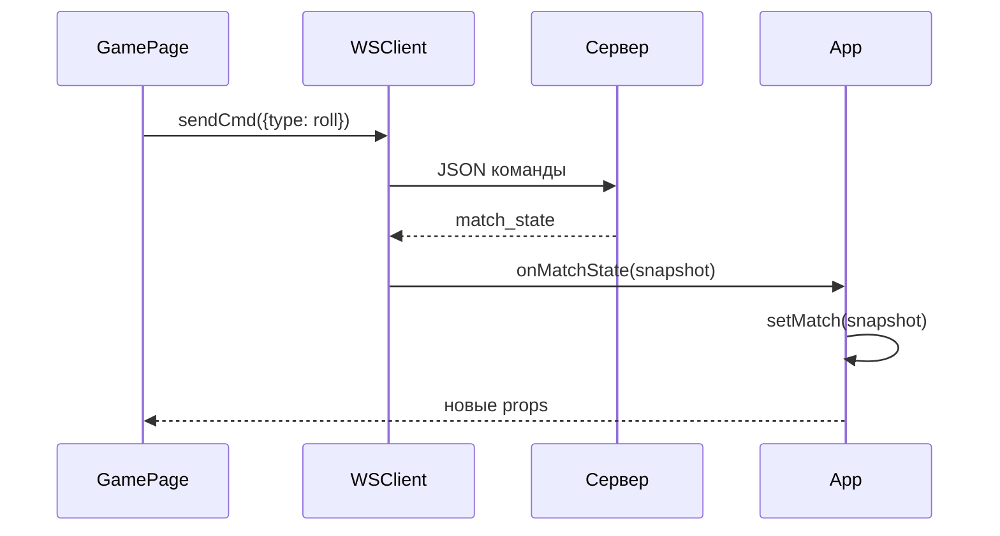

# Web клиент

[[React интерфейс]] · [[Стили и визуальные границы]] · [[Сервер и протокол]]

## Где начинается исполнение

[index.html](../../web/index.html) загружает [main.tsx](../../web/src/main.tsx). main монтирует App и импортирует styles.css.

App создаёт один WSClient через useMemo и хранит `room`, `match`, `status`, `error`, `log`. В useEffect назначает сетевые callbacks. Наличие match определяет экран: LobbyPage или GamePage. React Router в текущем приложении не используется.

## WSClient

[wsClient.ts](../../web/src/wsClient.ts) — обычный TypeScript-класс, не React-компонент.

| Метод | Принимает | Действие |
| --- | --- | --- |
| connect | URL, имя | Создаёт WebSocket и назначает обработчики |
| host | Количество мест | Отправляет create_room или сохраняет намерение до подключения |
| join | Код комнаты | Отправляет join_room или сохраняет намерение |
| startMatch | — | Отправляет start_match |
| setMap | ID и/или JSON | Отправляет set_map |
| sendCmd | Объект игрового действия | Добавляет match_id, cmd_id, seq и сохраняет ожидающую команду |
| handleMessage | Строка JSON | Разбирает сообщение, меняет поля клиента и вызывает callbacks |

Методы не возвращают новое состояние игры. Оно приходит отдельным сообщением.

Проверено 2026-10-02, Phase 1: MatchState описывает персональный network view; seed удалён, чужая res отсутствует, добавлены private dev_cards/public counts/bank_available/you_pid. TypeScript проходит. PendingCmds/seq сбрасываются при смене room_code+match_id. ACK, включая applied=false, удаляет intent; reconnect pruning убирает номера ≤ last consumed, остальные отправляются с исходным cmd_id. Старые ACK, snapshots других комнат/матчей и меньшего tick не возвращают прежнее состояние. `npm.cmd test` проверяет 7 transport cases; дизайн компонентов не менялся.

Выбранный инструмент, содержимое форм и выбор корабля меняются локально. Баланс ресурсов и постройки приходят в серверном снимке. Полный путь — [[Сценарий сетевой партии]].
