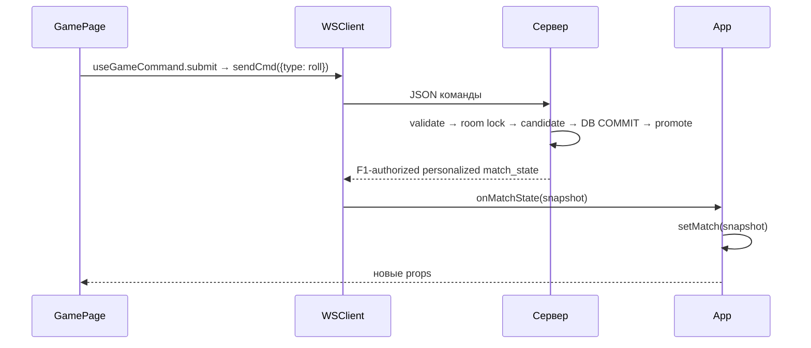

# Web клиент

[[React интерфейс]] · [[Стили и визуальные границы]] · [[Сервер и протокол]]

## Где начинается исполнение

[index.html](../../web/index.html) загружает [main.tsx](../../web/src/main.tsx). main монтирует App и импортирует styles.css.

App создаёт один WSClient через useMemo и хранит `room`, `match`, `status`, `error`, `log`. В useEffect назначает callbacks и один раз запускает restoreCurrentGame. AudioProvider/AuthProvider окружают приложение. При F2 compatibility_required приоритет имеет LegacyMatchPage без игровых controls; иначе match показывает GamePage, отсутствие match — LobbyPage с Home/Host/Join/Recent/Active Games либо текущей комнатой. React Router не используется.

Текущий `defaultWebSocketUrl` в [wsClient.ts](../../web/src/wsClient.ts) выбирает **page-origin /ws**: protocol страницы определяет ws/wss, её host/port сохраняются. В обычном development запрос идёт, например, на ws://localhost:5173/ws; [vite.config.ts](../../web/vite.config.ts) проксирует `/ws` и `/api` в backend, по умолчанию на 127.0.0.1:8000. Это позволяет cookie auth использовать тот же origin. Production /ws и /api обслуживаются через Nginx.

Development `VITE_WS_URL` остаётся явным override browser URL и определяет backend для Vite proxy; отдельное прямое guest-подключение к ws://127.0.0.1:8000/ws возможно через Advanced connection. Этот адрес также служит fallback без page host, но не является обычным browser development default. **Historical — Infrastructure Phase 1, 2026-10-04:** direct-backend development default и 25 web cases описывали тот checkpoint; same-origin development proxy добавлен для Auth Phase 1. Настройка и ограничения — [[Deployment#Account cookies and HTTPS — Auth Phase 1]].

## WSClient

[wsClient.ts](../../web/src/wsClient.ts) — обычный TypeScript-класс, не React-компонент.

| Метод | Принимает | Действие |
| --- | --- | --- |
| connect | URL, имя | Создаёт WebSocket и назначает обработчики |
| host | Количество мест | Отправляет create_room или сохраняет намерение до подключения |
| join | Код комнаты | Отправляет join_room или сохраняет намерение |
| startMatch | — | Отправляет start_match |
| setMap | ID и/или JSON | Отправляет set_map |
| continueGame / restoreCurrentGame | Recent entry / URL и сохранённый pointer | Guest proof → verified reconnect; без fallback по имени |
| continueAccount | Код комнаты, имя, URL | account_continue; сервер определяет owned seat по cookie session |
| sendCmd | Объект игрового действия | Добавляет match_id, cmd_id, seq и сохраняет ожидающую команду |
| handleMessage | Строка JSON | Разбирает сообщение, меняет поля клиента и вызывает callbacks |

Методы не возвращают новое состояние игры. Оно приходит отдельным сообщением.

Historical verification 2026-10-02, Phase 1: персональный network view, consumed-seq/ACK/reconnect ordering проверялись прежним suite. Эти семантики сохранены, но 7 transport cases не являются сегодняшним числом тестов. Последний полный web результат — **241 passed, F2, 2026-10-08**; последний полный Python — **757 passed, F3**. Даты/границы — [[Project State]]. F1 защищает каждую private publication актуальным ownership; F2 подавляет playable match_state/commands для restricted rulesets, сохраняя Continue notice и ownership.

Выбранный инструмент/ship source/victim хранятся в useBoardInteraction, draft формы — в UI. Default BoardRenderer 3D и сохранённый SVG получают один state/controller. Баланс ресурсов и постройки приходят в committed персональном снимке. Полный путь — [[Сценарий сетевой партии]], состав UI — [[React интерфейс]].
